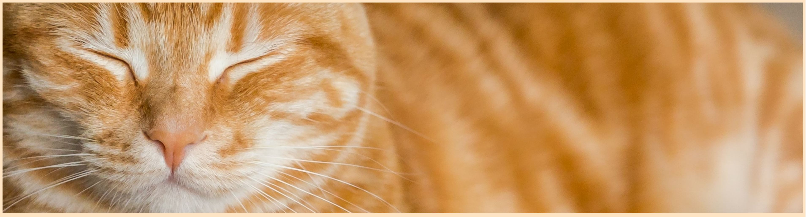

# Portfolio Project 1

A brief description of what this project does and who it's for

# Catmosphere 

 

This site is intended to display the establishment of Catmosphere cat café, what goods and services they provide and how to contact the business. 

 

Catmosphere is a fictional café based in Dublin, Ireland.  
The premises provides a foster home for rescued cats and kittens while also serving food and drinks to generate income to fully support the animals welfare. 
The website is a way to connect to possible guests to see what the café is all about and to book a meeting with the cats while also supporting animal protection charities and educating people on the subject of animal welfare. 

 

 

## Features  

 

The site is broken into 4 main pages being Home, Gallery, Menu and Book in. 

Home – This page holds a brief introduction and a house rules section, explaining how guests should prepare before arriving to Catmosphere. 
There is also two call to action sections; Menu and Book in. Clicking on these sections brings the user to the respected page. 

 

 

Gallery – This page includes a collage of images showing the interior of the café, the inhabitants and some of the products available. 

 

Menu– This page displays the available products and the prices.  
 
Book -In – This page includes a form to complete and secure a booking by adding in the customers details, party size, time and date, preference in cat and additional comments. 

 

### Navbar and Footer 

 

- __Navigation Bar__ 

 

- The navigation bar features the site logo which brings the user back to the home page, the page title and links to the Home, Gallery, Menu and Book In page.  

- The color scheme was chosen to be as calming as possible and not too bright. 
I believe the cream background compliments the burnt umber text coloring nicely and hints towards the cream of a coffee or a cappuccino . 
The font “fredoka one” was taken from google fonts and was selected because it looked comfortable and friendly. 

 

 

- __Footer__ 

 

- The footer includes the social media links in the form of logos from fontawesome.com, with a background of coffee beans to suggest that the contents of the social media links will include more café insight. The style of the footer appeared neat so I did not add anything further, although I would like to include a more intricate footer in future projects. 
 

 

 

 
 
 

 

 

 

 

 

## Home Page

- __Home Page Hero image__ 

 

- The home page uses a hero image at the head of it to show that the page is directed towards the main reason the café exists, cats. 

- __Contact/ About us Section__  

 

- The contact section is  minimal on the home page. It gives a short amount of information along with social media links. 

 

 

- __House rules Section__ 

- The house rules section found on the home page includes a few café rules that must be adhered to during the guests' stay at the café.  

 

- __Menu Section__ 

- This section includes a link to the menu page 

- __Book In Section__ 

- This section includes a link to the book in page 

## Gallery Page

- __Gallery Page Hero image__ 

 
- The gallery page uses a hero image at the head of it to show that the page is directed towards showing the interior of the café and guests, followed by the collage gallery showing more of the pre mentioned topics. 

-This page includes a photo collage spanning the entire page, the images used have alt descriptions included.

## Menu Page

- __Menu Page Hero image__ 

- The menu page uses a hero image at the head of it to show that the page is directed towards the food and drinks served in the café. This image of coffee beans is the same as the footer background image. 
- The design was to be as simple as possible to allow the layout to remain consistant at smaller screen sizes.

## Book In Page  

- __Book In Page Hero image__ 

- The home page uses a hero image at the head of it to show that the page is directed towards making a booking within the café. 
- This page includes a booking form where customers can book a time and date to visit the cafe. The form code is credited in the credits section below.

## Testing  

__Internal Links__ 

- The page links are both in the navbar of the page but also featured in the home page sections dividing the page.  

- The navbar links are tested page to page to ensure each is directing to the correct page. 

### Validator Testing  
 During testing there were minor issues found in both the html and css which have now been resolved. 

HTML 
- Previous versions of the site included an embedded google map, this repeatedly failed validation and as a result the map was removed from the final version of the site.
- No errors were returned when passing through the official [W3C validator]
-validator results = https://validator.w3.org/nu/?doc=https%3A%2F%2Ft-mcgauley.github.io%2FPortfolio-Project-1%2F

CSS 
- No errors were found when passing through the official [(Jigsaw) validator](https://jigsaw.w3.org/css-validator/) 
- validator results = https://jigsaw.w3.org/css-validator/validator?uri=https%3A%2F%2Ft-mcgauley.github.io%2FPortfolio-Project-1%2F&profile=css3svg&usermedium=all&warning=1&vextwarning=&lang=en

 

### Unfixed Bugs 

 

So far through testing there have been no bugs which have not been fixed. Bugs which needed to be fixed during the development included incorrect media queries and google map embedded issues.  

 

## Deployment  

 

- The site was deployed to GitHub pages. The steps to deploy are as follows:  

- In the GitHub repository, navigate to the Settings tab  

- From the source section drop-down menu, select the Master Branch 

- Once the master branch has been selected, the page will be automatically refreshed with a detailed ribbon display to indicate the successful deployment.  

 

The live link can be found here - https://t-mcgauley.github.io/Portfolio-Project-1/

 

## Credits  

- Gallery collage section code was inspired by the love running project gallery page.
- Book in form code was found at https://codepen.io/tutsplus/pen/wNaGjy and modified to fit the required topic.
- Media query help  https://www.youtube.com/watch?v=P_vkS4UJNDk
- overall html css guide https://www.youtube.com/watch?v=UB1O30fR-EE
 

 

 

### Content  

- The icons used are from [Font Awesome](https://fontawesome.com/) 
- The fonts used are from [Google fonts](https://fonts.google.com/)
 

### Media 

- Images used have been downloaded from [Pexels](https://www.pexels.com/)

 

